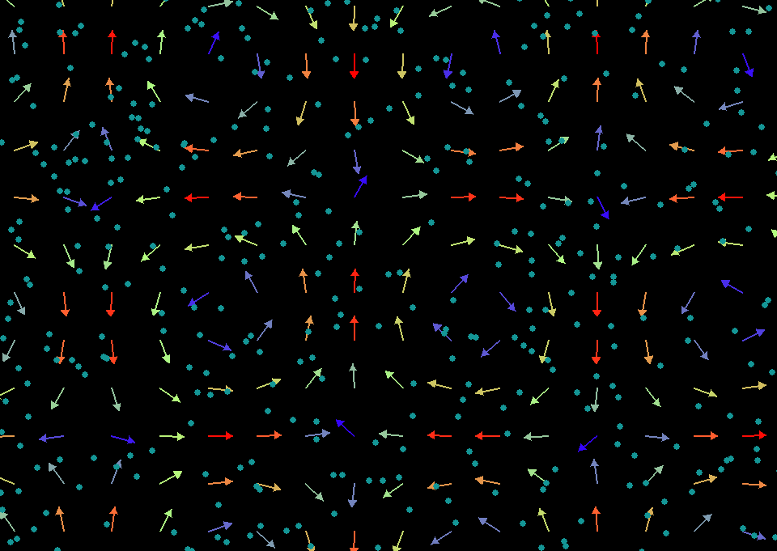
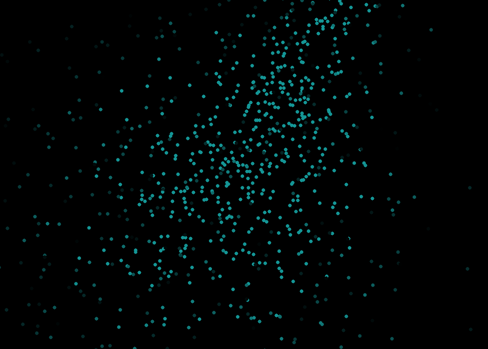
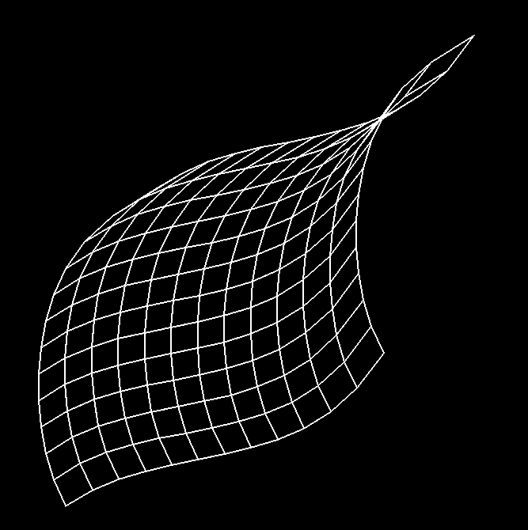

# VectorFlow
This is a small project of mine to visualize vector fields with moving particles and mesh transformations.

  
   
  

### Requirements:
numpy and pygame need to be installed.

### How to use:
- Choose a vector field function by editing the get_vel function in param/\_\_init\_\_.py. Some examples are already commented out in the function body.
- Choose additional parameters in param/\_\_init\_\_.py.
- Choose what to render in main.py.
  - To render particles moving in the vector field, make sure to have `field.update()` and `field.display()` uncommented in the event loop.
  - To render a mesh transformation, uncomment `grid.draw(...)` and `grid.transform()` in the event loop.
- Run main.py